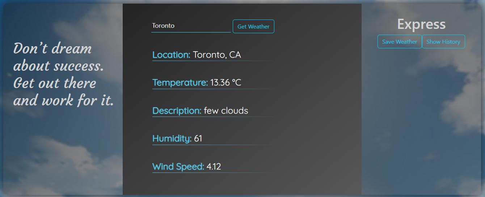
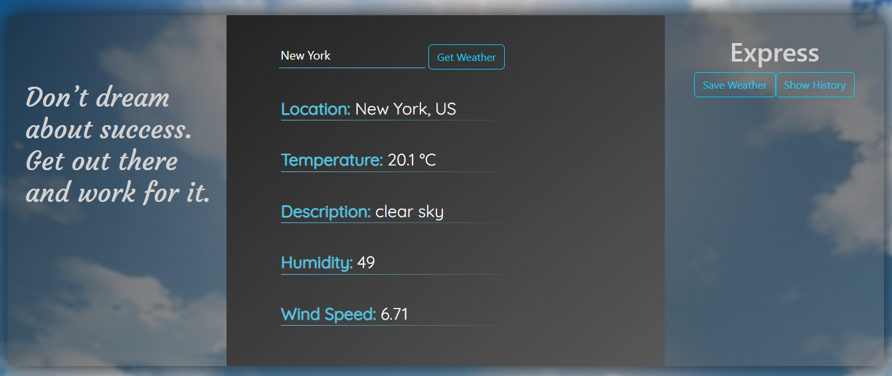
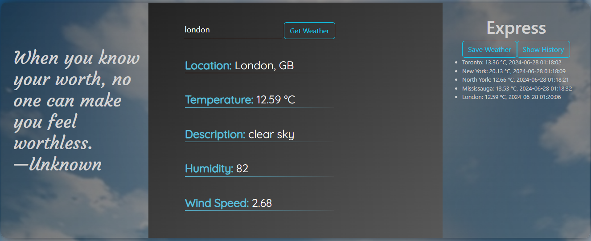

# TVO Weather Assignment Report

This report details the development journey of TVO Weather, a user-focused weather application designed for ease of use and comprehensive functionality.  The development process was divided into clear stages, each contributing to the final product.


### 1. Competitor Analysis

The project began by analyzing leading weather websites like The Weather Network and weather.com. This helped identify valuable features, user interface (UI) elements, and data presentation methods to incorporate into TVO Weather.

### 2. UI Design

The goal was to create an intuitive and visually appealing UI that met the assignment requirements while offering room for future enhancements and growth (scalability). It was achieved by using `Figma` for mockups and design iterations. The final design utilizes a three-column layout based on `Bootstrap`:

- Left Column (20%): Dedicated to consistant navigation elements.
- Center Column (60%): Houses weather search and display (main assignment).
- Right Column (20%):  Provides user-interactive features (Express backend).

### 3. Mockup Creation

This step involved creating the application's basic structure using `React/Vite`. This established the core framework of the application, including setting up essential folders and files.

### 4. Component Hierarchy and Breakdown
Define the structure and responsibility of each component in the application by analyzing independent components in UI. The key components were designed as:

```
    App   ------------------------------- Serves as root container.
    ├── HeaderLeft  --------------------- Consistent header, displays title/logo/nav.
    ├── HeaderRight --------------------- Express functions: saving, retrieving, API calls.
    └── Weather ------------------------- Container for state management and user interaction.
        ├── WeatherDisplay -------------- Fetches and displays weather data.
        └── WeatherForm ----------------- Handles user input for location and submits queries.
```
- Outcome: Clear component hierarchy ensuring modular, clean, maintainable, and scalable code.

### 5. Functional Development (v1)
- Implement core functionality for fetching and displaying weather data.
    - Set up Axios to fetch data from the OpenWeatherMap API.
    - Display weather information to the user.
    - Handle user input and queries via the WeatherForm component.
    - Pass props between simbling components to save and show history in Express backend.
- Outcome: Fully functional application capable of fetching and displaying weather data based on user input.

### 6. Styling and Content Enrichment (v2)
- Objective: Enhance the visual appeal and content richness of the application.
- Tasks:
    - Style each component using CSS for a polished look.
    - Add a "Quote of The Day" feature for placeholder purpose of navigation.
- Outcome: Visually appealing application with enriched content for a better user experience.

### 7. Backend Integration (v3)
- Objective: Connect the application to an Express backend.
- Tasks:
    - Develop a Save/Show component to allow users to save and retrieve weather data.
    - Set up Express server and endpoints for data storage and retrieval.
- Outcome: Application with backend integration, enabling users to save and access their weather data.

### 8. Screenshots for Reference
</img></a>
</img></a>
</img></a>

# Conclusion
The TVO Weather application was developed through a structured process, from initial competitor analysis to final backend integration. Each stage was meticulously planned and executed, resulting in a robust, user-friendly weather forecasting tool. This document serves as a comprehensive record of the development process, highlighting the key decisions and outcomes at each step.

# Contribution

1. http://weather.com
2. https://www.theweathernetwork.com/en 
3. https://www.figma.com/
4. https://getbootstrap.com/
5. https://vitejs.dev/guide/
6. https://react.dev/